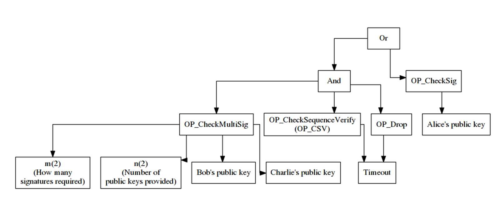

# TAPROOT CUSTEM SYSTEM 

## Libs, whose include in project 
1. btcutils
2. btcd

## Scheme

### Asset's 

1. [Taproot - most importend update in Bitcoin | blog.trusteeglobal.com](https://blog.trusteeglobal.com/ru/taproot-obnovlenie-v-protokole-bitcoin/)
2. [Taproot Demonstration | blog.bitmex.com](https://blog.bitmex.com/ru_ru-taproot-demonstration/)
### trash

"github.com/btcsuite/btcd/btcec/v2"
	"github.com/btcsuite/btcd/btcutil"
	"github.com/btcsuite/btcd/chaincfg"
	"github.com/btcsuite/btcd/txscript"